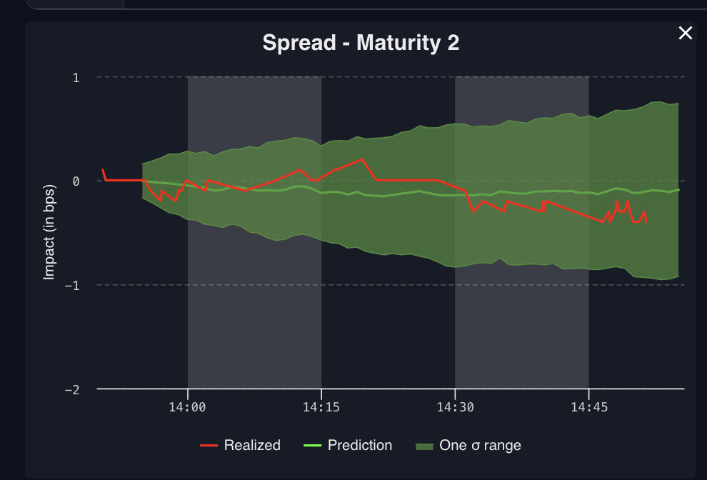
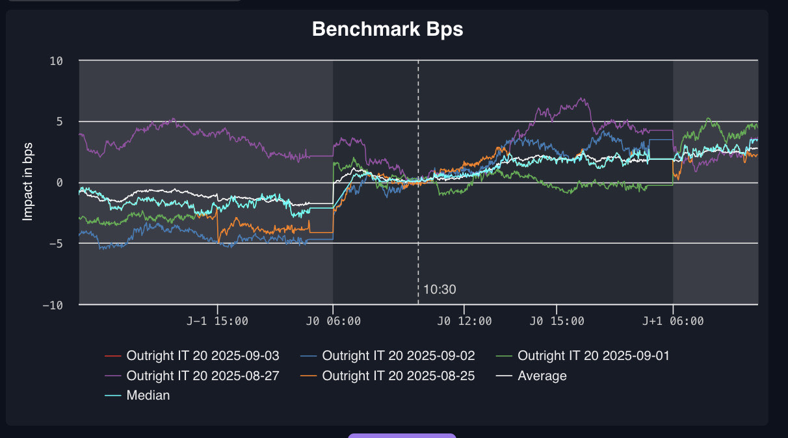
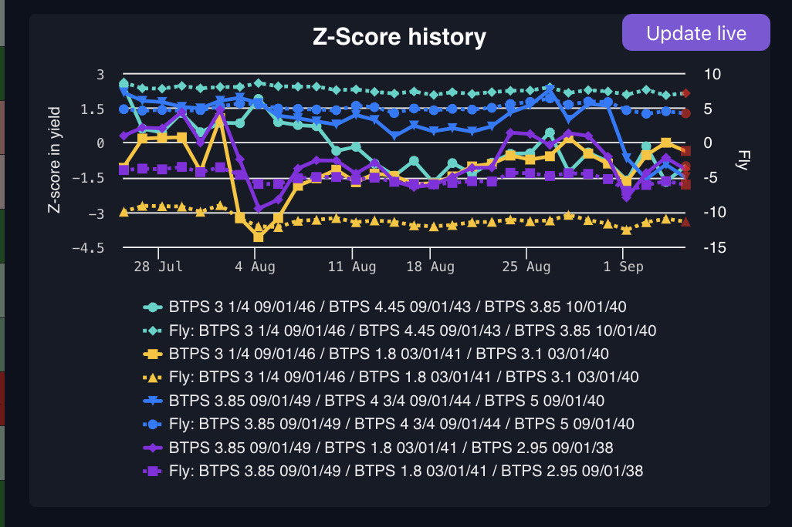
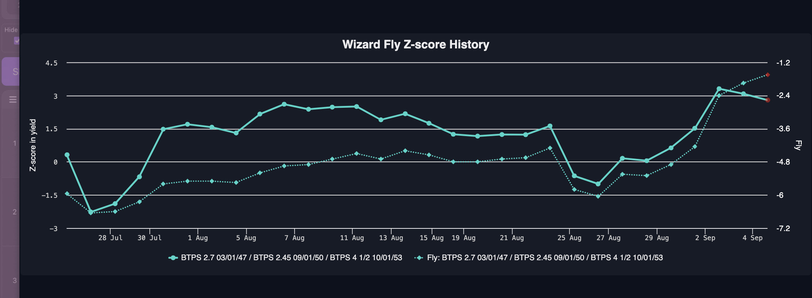
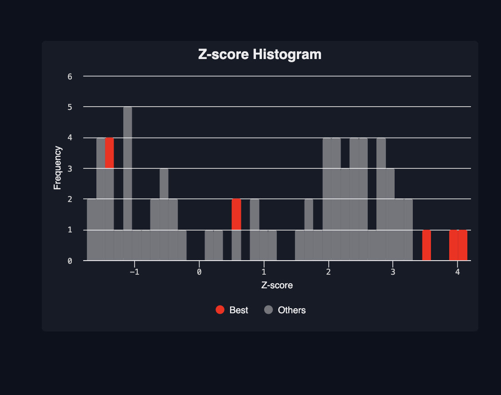
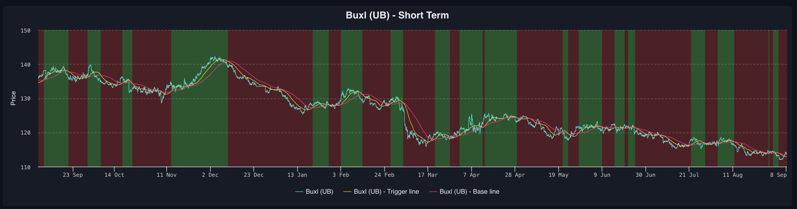
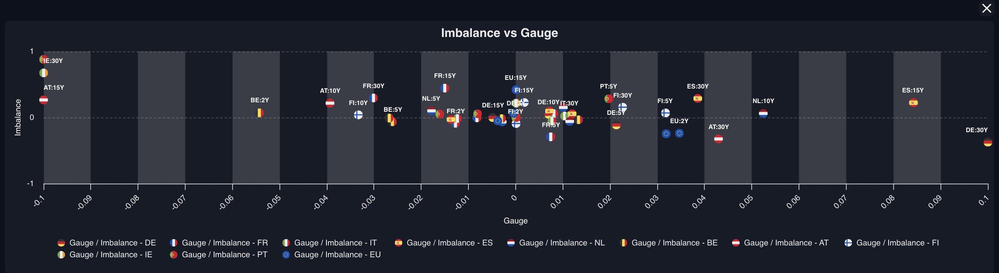

# Fusion Chart Test Project

This project is only intended to test **Fusion Chart**.

👉 Here is the link to the page: [Fusion Charts Demo](https://fusion-charts.vercel.app/)

---

---

## Previous Work (Quantfox)

Here are some sample charts I worked with during my time at **Quantfox** using **Highcharts**:

